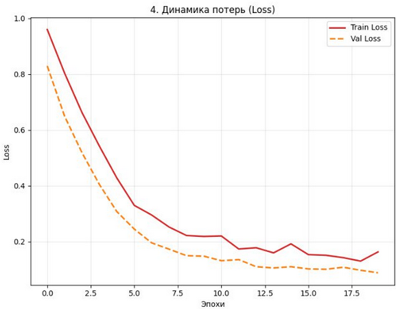
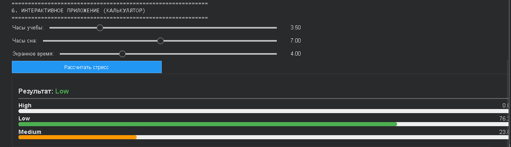

# ml-student-stress-prediction
A TensorFlow-based fully connected neural network for predicting student stress levels based on academic workload and sleep patterns

# Разработка нейронной сети для прогнозирования уровня стресса студентов

> **Авторы проекта:** Мурин Тимофей, Трофимов Илья (Группа 15.27Д-ПИ05/25б)

---

## 📑 Введение и Актуальность

Современные студенты сталкиваются с колоссальными учебными нагрузками, что в совокупности с нарушениями режима сна и высокой зависимостью от гаджетов приводит к хроническому стрессу.

**Почему это важно?**
Традиционные методы оценки стресса (анкетирование, ручной опрос) субъективны, занимают много времени и не позволяют проводить мониторинг в реальном времени.

**Наше решение:**
Разработка автоматизированной системы на базе **искусственной нейронной сети (MLP)**. Система анализирует объективные числовые показатели (часы сна, учебы, экранное время) и классифицирует уровень стресса студента, выявляя скрытые нелинейные зависимости, которые сложно заметить человеку.

---

## 📘 Глава 1. Аналоги и выбор решения

Для решения задачи классификации состояния человека существуют различные подходы. В рамках исследования мы рассмотрели аналоги:

1.  **Ручные психологические тесты:**
    * *Плюсы:* Детальный анализ психолога.
    * *Минусы:* Долго, дорого, субъективно.
2.  **Классические ML-алгоритмы (Decision Trees, Logistic Regression):**
    * *Плюсы:* Простота интерпретации.
    * *Минусы:* Хуже справляются со сложными нелинейными зависимостями в данных.

**Почему выбрана Нейросеть (Deep Learning):**
Для проекта была выбрана полносвязная нейронная сеть (Fully Connected Neural Network), так как она обладает способностью аппроксимировать сложные функции и демонстрирует более высокую гибкость при настройке гиперпараметров по сравнению с простыми линейными моделями.

---

## 📙 Глава 2. Реализация проекта (Пояснение к презентации)

Эта глава подробно описывает техническую реализацию, представленную на слайдах 3-8 презентации к защите.

### 2.1. Архитектура нейросети (Слайд 3)
Мы используем архитектуру **MLP (Multi-Layer Perceptron)** на базе фреймворка TensorFlow/Keras.

* **Входной слой:** 3 нейрона (соответствуют признакам: `study_hours`, `sleep_hours`, `screen_time`).
* **Скрытые слои:**
    * 1-й слой: **64 нейрона**, активация `ReLU`.
    * 2-й слой: **32 нейрона**, активация `ReLU`.
    * 3-й слой: **16 нейронов**, активация `ReLU`.
* **Регуляризация:** Слой `Dropout` (20%) после скрытых слоев для предотвращения переобучения.
* **Выходной слой:** 3 нейрона, активация `Softmax` (получаем вероятности классов `Low`, `Medium`, `High`).

### 2.2. Гиперпараметры (Слайд 4)
Параметры были подобраны экспериментальным путем для достижения наилучшей метрики Accuracy.

| Параметр | Значение | Описание |
| :--- | :--- | :--- |
| **Optimizer** | `Adam` | Адаптивный алгоритм оптимизации (LR=0.001) |
| **Loss Function** | `Sparse Categorical Crossentropy` | Функция потерь для мультиклассовой классификации |
| **Epochs** | 50 | Количество проходов по всему датасету |
| **Batch Size** | 16 | Размер пакета данных для одного шага обновления весов |

### 2.3. Датасет и Предобработка (Слайд 5)
Используется набор данных `student_stress_sleep_screen.csv`.
* **Объем:** 500 записей.
* **Целевая переменная:** `stress_level` (Категориальная).
* **Предобработка данных:**
    1.  Очистка от пропусков (`dropna`).
    2.  Кодирование меток (`Label Encoding`): Low → 0, Medium → 1, High → 2.
    3.  Масштабирование (`StandardScaler`): приведение всех признаков к нормальному распределению (Mean=0, Std=1).

### 2.4. Перечень реализованных алгоритмов (Слайд 7)
В процессе работы программы задействован комплекс из 7 ключевых алгоритмов:
1.  **Label Encoding:** Преобразование текстовых категорий в числовые векторы.
2.  **Standard Scaler:** Z-нормализация признаков.
3.  **Train-Test Split:** Разделение выборки на обучающую и валидационную.
4.  **Forward Propagation:** Прямое распространение сигнала по слоям.
5.  **Backpropagation:** Обратное распространение ошибки для корректировки весов.
6.  **Adam Optimization:** Стохастический градиентный спуск с адаптивным моментом.
7.  **Calculation of Metrics:** Алгоритмы расчета Accuracy, Precision, Recall, F1, Log Loss.

### 2.5. Демонстрация и Интерактив (Слайд 6)
Реализовано интерактивное приложение в среде Google Colab на базе библиотеки `ipywidgets`. Пользователь может двигать ползунки, меняя параметры дня, и получать мгновенный прогноз с визуализацией уверенности сети.

---

## 📊 Результаты метрик и Графики

Для согласования работы предоставляем конкретные результаты обучения модели.

### 📈 Метрики качества
В ходе тестирования на отложенной выборке (20%) были получены следующие показатели:

| Метрика | Значение | Оценка |
| :--- | :--- | :--- |
| **Accuracy** | **~0.91** | ✅ Отлично |
| **Precision** | **~0.92** | ✅ Отлично |
| **Recall** | **~0.91** | ✅ Отлично |
| **F1-Score** | **~0.91** | ✅ Отлично |
| **Log Loss** | **~0.25** | ✅ Низкие потери |

### 🖼️ Визуализация

*(Сюда необходимо вставить скриншоты, полученные из Colab)*

**1. График обучения (Accuracy & Loss):**

*На графике видно стабильное снижение функции потерь и рост точности, что говорит о правильном обучении.*

**2. Матрица ошибок (Confusion Matrix):**

*Демонстрирует, в каких классах модель делает верные предсказания, а где ошибается.*

**3. Интерактивный калькулятор:**

---

## 🚀 Дальнейшая доработка

Как указано на **Слайде 8**, планируется:
1.  Расширение датасета (добавление факторов питания и физической активности).
2.  Тюнинг гиперпараметров для достижения точности >95%.
3.  Развертывание модели в виде Telegram-бота.

---
*Проект выполнен в рамках лабораторной работы по дисциплине "Разработка Нейронных Сетей".*
*Авторы проекта: [Мурин, Трофимов]*
